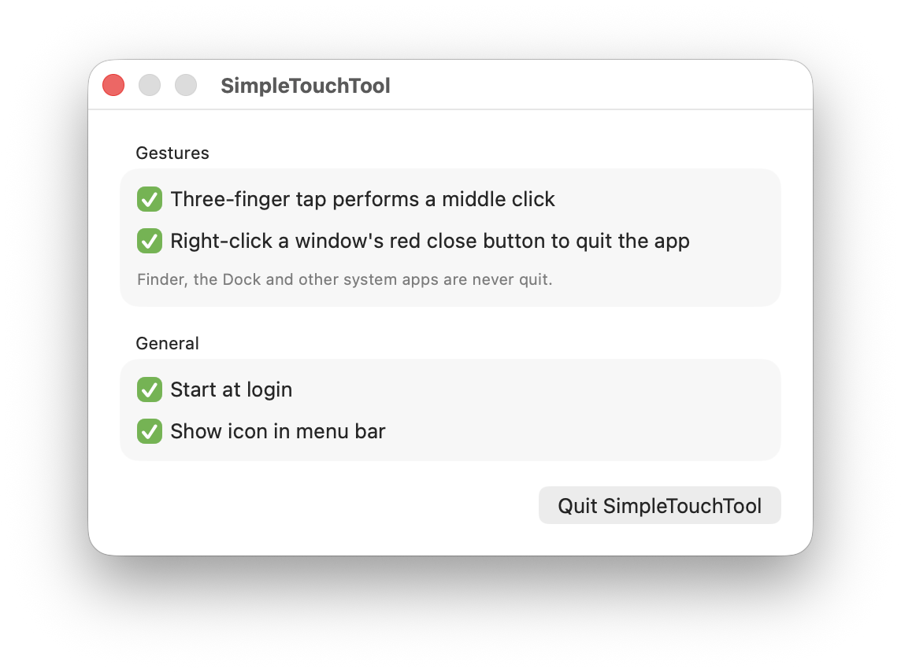

# SimpleTouchTool

A tiny macOS menu bar utility that adds two trackpad/mouse shortcuts:

- **Three-finger tap → middle click.** Tap the trackpad with three fingers to middle-click wherever the cursor is (open links in new tabs, close tabs, paste in terminals, etc.).
- **Right-click the red close button → quit the app.** Right-click (or two-finger click) a window's red ✕ button to quit that app entirely instead of just closing the window. Finder, the Dock and other system apps are never quit. Apps quit normally, so they still ask you to save unsaved work.

Both can be turned on or off individually.

<p align="center"></p>

## Features

- Runs quietly in the background with an optional menu bar icon
- Settings window whenever you open the app (so the menu bar icon can be hidden)
- Adds itself to Login Items on first run (you can turn this off, and it stays off)
- No dependencies, a single Swift file, about 220 KB

## Requirements

- macOS 13 Ventura or later
- Xcode Command Line Tools (`xcode-select --install`) to build

## Build & install

```sh
git clone https://github.com/firefinchdev/SimpleTouchTool.git
cd SimpleTouchTool
./build.sh
cp -R build/SimpleTouchTool.app /Applications/
open /Applications/SimpleTouchTool.app
```

## Permissions

SimpleTouchTool needs **Accessibility** access to read clicks and send middle clicks:

**System Settings → Privacy & Security → Accessibility → enable SimpleTouchTool**

The app prompts for this on first launch and starts working as soon as it's granted.

> The build is ad-hoc signed, so macOS treats every rebuild as a new app. After rebuilding, remove SimpleTouchTool from the Accessibility list and add it again.

## Tips

- If a three-finger tap also triggers **Look up**, turn off *System Settings → Trackpad → Point & Click → Look up & data detectors*, or switch it to "Force Click with one finger".
- If the menu bar icon is hidden, open SimpleTouchTool again from Applications or Spotlight to get to the settings window.

## How it works

- **Middle click:** uses Apple's private `MultitouchSupport` framework (loaded at runtime, as the [MiddleClick](https://github.com/artginzburg/MiddleClick) project does) to read raw trackpad touches. It counts a tap when exactly three fingers touch down and lift within 0.3 s without moving, then posts a middle click. Because this framework is private, a future macOS update could break it.
- **Quit on close button:** a `CGEventTap` watches for right-clicks. The Accessibility API hit-tests the element under the cursor, and if it's a window's close button (`AXCloseButton`) belonging to a regular, non-system app, the click is swallowed and the app is sent a normal quit request.

## Project layout

```
Sources/main.swift   app logic, menu bar and settings window
Sources/Bridge.h     MultitouchSupport type definitions
Info.plist           bundle metadata (menu bar app, no Dock icon)
build.sh             builds and ad-hoc signs build/SimpleTouchTool.app
```
